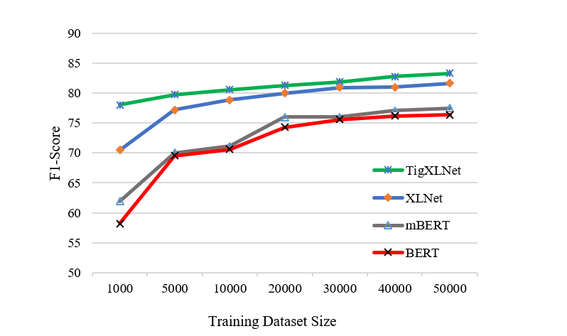

# Transferring Monolingual Model to Low-Resource Language: The Case Of Tigrinya:

Documenation is coming soon with full code!

## Proposed Method:

The proposed method transfers a mono-lingual Transformer model into new target language at lexical level by learning new token embeddings. All implementation in this repo uses XLNet as a source Transformer model, however, other Transformer models can also be used similarly. 

## TigXLNet:

## Main files:
 - Train.ipynb : Fine-tunes XLNet (mono-lingual transformer) on new target language (Tigrinya)
 - Test.ipynb : Evaluates the fine-tuned model on test data 
 - Word2Vec_token_embeddings_for_xlnet.ipynb : Trains a word2vec token embeddings for Tigrinya language to be used for XLNet embeddings
 - Text_processing_for_language_identification.ipynb : Extracts Tigrinya comments from mixed language contents
 - YouTube_comment_downloader.ipynb : Download all avaialble comments from a YouTube channel (Channel ID as input)
 - auto_labelling.ipynb : Automatically labels Tigrinya comments in to positive or negative sentiments based on [Emoji's sentiment](http://kt.ijs.si/data/Emoji_sentiment_ranking/)  
 
 
 
 All files are IPython Notebook files which can be excuted simply in Google Colab
 
 ## Evaluation:
 
 The proposed method is evaluated using two datasets:
  - A newly created sentiment analysis dataset for low-resource language (Tigriyna) 
   
  <table>
   <tr>
    <td> <table>
    <thead>
        <tr>
            <th>Models</th>
            <th>Configuration</th>
            <th>F1-Score</th>
        </tr>
    </thead>
    <tbody>
        <tr>
            <td rowspan=3>BERT</td>
            <td rowspan=1>+Frozen BERT weights</td>
            <td>54.91</td>
        </tr>
        <tr>
            <td rowspan=1>+Random embeddings</td>
            <td>74.26</td>
        </tr>
        <tr>
            <td rowspan=1>+Frozen token embeddings</td>
            <td>76.35</td>
        </tr>     
        <tr>
            <td rowspan=3>mBERT</td>
            <td rowspan=1>+Frozen mBERT weights</td>
            <td>57.32</td>
        </tr>
        <tr>
            <td rowspan=1>+Random embeddings</td>
            <td>76.01</td>
        </tr>
        <tr>
            <td rowspan=1>+Frozen token embeddings</td>
            <td>77.51</td>
        </tr>        
        <tr>
            <td rowspan=3>XLNet</td>
            <td rowspan=1>+Frozen XLNet weights</td>
            <td><strong>68.14</strong></td>
        </tr>
        <tr>
            <td rowspan=1>+Random embeddings</td>
            <td><strong>77.83</strong></td>
        </tr>
        <tr>
            <td rowspan=1>+Frozen token embeddings</td>
            <td><strong>81.62</strong></td>
        </tr>
    </tbody>
</table> </td>
      <td></td>
  </tr>
 </table>

  
        
  - Cross-lingual Sentiment dataset ([CLS](https://zenodo.org/record/3251672#.Xs65VzozbIU))
  
  
  <table>
    <thead>
        <tr>
            <th rowspan=2>Models</th>
            <th rowspan=1 colspan=3>English</th>
            <th rowspan=1 colspan=3>German</th>
            <th rowspan=1 colspan=3>French</th>
            <th rowspan=1 colspan=3>Japanese</th>
            <th rowspan=2>Average</th>
        </tr>
        <tr>
            <th colspan=1>Books</th>
            <th colspan=1>DVD</th>
            <th colspan=1>Music</th>
            <th colspan=1>Books</th>
            <th colspan=1>DVD</th>
            <th colspan=1>Music</th>
            <th colspan=1>Books</th>
            <th colspan=1>DVD</th>
            <th colspan=1>Music</th>
            <th colspan=1>Books</th>
            <th colspan=1>DVD</th>
            <th colspan=1>Music</th>
        </tr>
    </thead>
    <tbody>
        <tr>
            <td colspan=1>XLNet</td>
            <td colspan=1><strong>92.90</strong></td>
            <td colspan=1><strong>93.31</strong></td>
            <td colspan=1><strong>92.02</strong></td>
            <td colspan=1>85.23</td>
            <td colspan=1>83.30</td>
            <td colspan=1>83.89</td>
            <td colspan=1>73.05</td>
            <td colspan=1>69.80</td>
            <td colspan=1>70.12</td>
            <td colspan=1>83.20</td>
            <td colspan=1><strong>86.07</strong></td>
            <td colspan=1>85.24</td>
            <td colspan=1>83.08</td>
        </tr>
        <tr>
            <td colspan=1>mBERT</td>
            <td colspan=1>92.78</td>
            <td colspan=1>90.30</td>
            <td colspan=1>91.88</td>
            <td colspan=1><strong>88.65</strong></td>
            <td colspan=1><strong>85.85</strong></td>
            <td colspan=1><strong>90.38</strong></td>
            <td colspan=1><strong>91.09</strong></td>
            <td colspan=1><strong>88.57</strong></td>
            <td colspan=1><strong>93.67</strong></td>
            <td colspan=1><strong>84.35</strong></td>
            <td colspan=1>81.77</td>
            <td colspan=1><strong>87.53</strong></td>
            <td colspan=1><strong>88.90</strong></td>
        </tr> 
    </tbody>
</table> 
 
